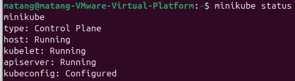
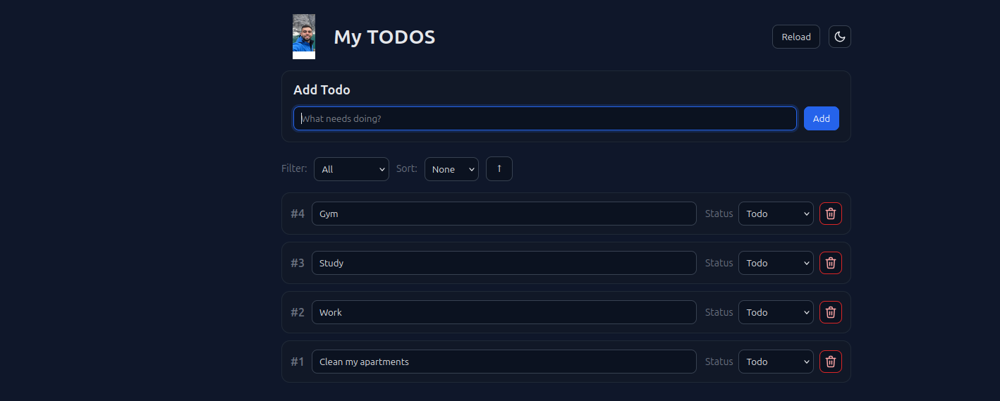

# Cloud-Native Microservices Todo Application Stack

A production-ready microservices application orchestrated with Kubernetes. This project traces a comprehensive engineering lifecycle—evolving from baseline declarative specifications into structured, multi-environment GitOps Kustomize pipelines, and ultimately abstracting the entire lifecycle into an enterprise-grade Helm v3 package with zero-trust network topology.

---

## 📸 Application Preview

### Core Infrastructure State


### Live Application Workspace


---

## 🏗️ System Architecture & Traffic Routing

Traffic enters via a unified ingress abstraction layer, dynamically routing web traffic and state operations across decoupled microservice runtimes using a Traefik Ingress Controller:

```text
                           [ Traefik Ingress ] (todolist.local)
                                    |
         +--------------------------+--------------------------+
         | /                        | /webui                   | /todos
         v                          v                          v
 [ Vue.js Web UI ]         [ Flask Frontend ]          [ REST API Backend ]
   (Port 8080)               (Port 5000)                 (Port 8080)
         |                          |                          |
         +-------------+------------+                          |
                       | (Egress Allowed)                      | (Egress Allowed)
                       v                                       v
               [ CoreDNS (Port 53) ]               [ MariaDB StatefulSet ]
                                                       (mariadb-headless:3306)
